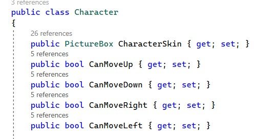
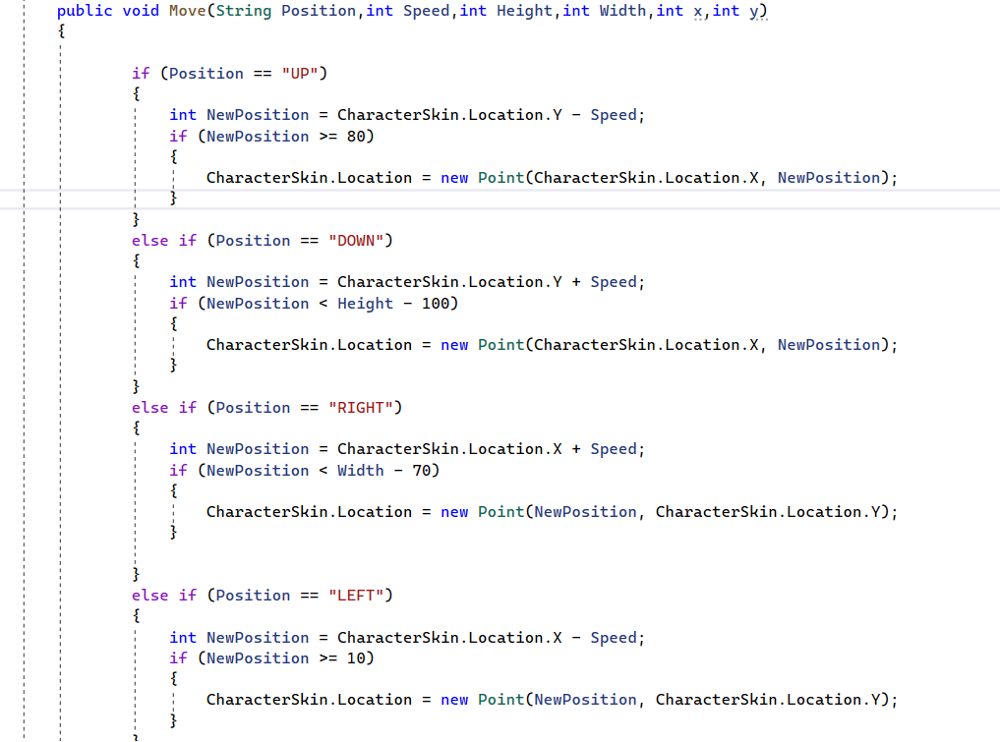
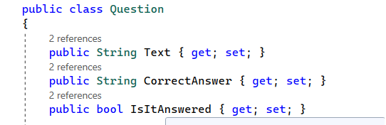
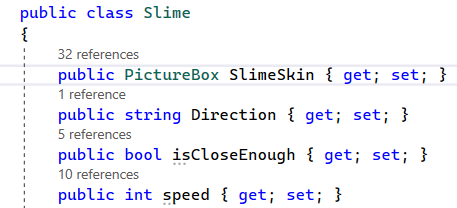
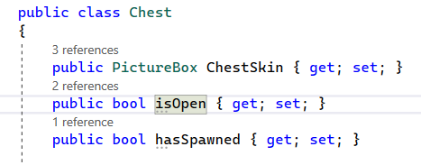

# Can-you-pass-Visual-programming
Windows Forms Project од страна на Живче Глигоров, Тамара Јосифовска и Верoника Коцева.

## Опис на апликацијата
Апликацијата која ја развивамe е игра која се состои од  два карактери, првиот карактер е главна улога, која цели да собере што е можно повеќе поени, додека вториот карактер е противник, кој ќе се обидува да ги намали бројот на поени.Играта вклучува две нивоа: нивото AIT и нивото CS. Нивото AIT е почетното ниво и е дизајнирано за полесно искуство на играње, додека нивото AIT е понапредно кое претставува предизвик за играчите кои бараат повеќе предизвици и брзина.

## Упатство за користење

  

 (Слика 1)

На почетниот прозорец  (Слика 1) при стартување на играта имаме можност да започнеме со играта (Start), да ги погледнеме инструкциите за играта  (Help) и доколку сакаме да завршиме со играта(Quit).

### Help

  

 (Слика 2)

Во Help е обајаснето начинот на движење на карактерот во играта.

### Старт (Start)

Со стартување на играта се прикажува прозорец каде можеме да избереме ниво AIT и нивото CS.

  

 (Слика 3)

  

 (Слика 4)

  

 (Слика 5)

Нивото AIT е првото ниво во играта и е дизајнирано да биде полесно. Ова ниво, се започнува со почетни 10 поени и со секоја собрана ѕвездичка поените се зголемуваат, а бонус поени добивате со секое точно одговорено прашање поврзано со визуелно програмирање кое е сместени во мистериозна кутија  (Слика 5). Воедно, целта е да се избегне противникот, кој се движи побавно во ова ниво доколку не успеете ви се одземмат поени.

Ниво CS започнува со  почетни -10 поени, во ова ниво целта е да се соберат поени и да избегнете вашето побрзо противничко лице кое воспротивно ги намалува поените. Исто така, има можност да се освојат бонус поени со точно одговорени прашања поврзани со визуелно програмирање кои исто така се сместени во мистеризната кутија. Ова ќе помогне да се добие дополнителни поени и да ги подобрите вашите вештини во играта.

Целта на играта е да се избегне slime-от кој доколку е во непосредна близина ве заразува со негововата радијација, ефектот на радијација предизвикува поените на играчот да се намалуваат постепено од зависност кое ниво е одберено.
За да престанат да се намалуваат поените и да се излечи играчот од радијацијата на slime-от потребно е да се собере една звездичка.

## Решение на проблемот

### Податочни структури

Текот на играта е осмислен во класа public class Game.

  

 (Слика 6)

1. Во неа е дефиниран објект од класата Character кој го претставува главниот карактер со кој играчот ќе собира поени. Во оваа класа се дефинирани вредности за движењата на карактерот.

  

 (Слика 7)

Исто така во оваа класа на карактерот дефинирана е и функција која го контролира движењето на карактерот public void Move(String Position,int Speed,int Height,int Width,int x,int y). Во функцијата се испраќа String Position во зависност од тоа кое копче е стиснато. Поради можните 4 движења (горе, долу лево и десно) имаме 4 услови. Во упатството веќе видовме кои копчиња се користат за придвижување на карактерот, па така на пример ако е притиснато копчето "W", Position ќе има вредност "UP", ќе биде исполнет првиот услов и карактерот ќе се движи нагоре.

  

 (Слика 8)

2. Во класата Game има дефинирано и листа од објекти од класата public class Star кои претставуваат звездички што главниот карактер треба да ги собира за поени.

  

 (Слика 8)

3. Исто така имаме и листа од објекти од класа public class Question. Во оваа листа се прашањата кои носат бонус поени и се наоѓаат во мистериозна кутија која се појавува во текот на играта. Во оваа класа има дефинирано текст т.е прашањето (public String Text), точниот одговор на прашањето со кој ќе споредуваме дали играчот одговорил точно и заслужува бонус поени или неточно и треба да му се одземат поени (public String CorrectAnswer) и дефинирана е bool вредност која ни кажува дали прашањето е одговорено (public bool IsItAnswered).

  

 (Слика 9)

4. Класата Game содржи и објект кој го претставува противникот од класа public class Slime. Дефинирани се вредности за неговата насока, близината со карактерот и брзината со која се движи и е потребна за различните тежински нивоа.

  

 (Слика 10)

5. Има integer вредности за поените (public int Score) и за времето (public int Time) кое истекува во текот на играта.
   
6. На крајот е дефинирана мистериозната кутија - објект од класа  public class Chest.

  

 (Слика 10)

Во самиот код на прозорецот за играта (public partial class GameWindow : Form) е дефинирана игра - објект од класата Game што ја опишавме и потребните функции кои ја водат играта.
