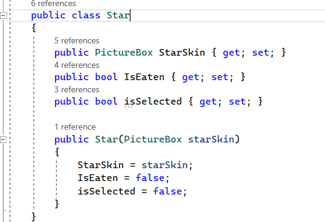

# Can-you-pass-Visual-programming  
Windows Forms Project by Zhivche Gligorov, Tamara Josifovska, and Veronika Koceva.

## Application Description  
The application we are developing is a game consisting of two characters. The first character is the protagonist, whose goal is to collect as many points as possible, while the second character is the opponent, who will try to reduce the number of points. The game includes two levels: the AIT level and the CS level. The AIT level is the beginner level, designed for an easier gaming experience, while the CS level is more advanced, presenting a challenge for players who seek more challenges and speed.

## User Guide  

  
    

  

 (Image 1)

On the startup window  (Image 1), when starting the game, you can choose to start the game (Start), view the game instructions (Help), or quit the game (Quit).

### Help  

  
    

  

 (Image 2)

In the Help section, the character's movement in the game is explained.

### Start (Start)  

When the game starts, a window appears where you can choose between the AIT and CS levels.

  
    

  

 (Image 3)

  
    

  

 (Image 4)
  

  
    

  

 (Image 5)

The AIT level is the first level of the game and is designed to be easier. This level starts with an initial score of 10 points, and with each collected star, the points increase. Bonus points are awarded for each correctly answered question related to visual programming, which is located in a mysterious box  (Image 5). Additionally, the goal is to avoid the opponent, who moves slower in this level. If you fail, points are deducted.

The CS level starts with -10 points. In this level, the goal is to collect points while avoiding your faster opponent, who will try to reduce your points. Bonus points can also be earned by answering questions related to visual programming, located in the mysterious box. This helps earn additional points and improve your skills in the game.

The objective of the game is to avoid the slime, which, if close to you, infects you with its radiation. The effect of radiation causes your points to gradually decrease depending on the selected level.  
To stop the points from decreasing and heal from the slime's radiation, you must collect a star.

## Solution to the Problem  

### Data Structures  

The flow of the game is designed in the class `public class Game`.

  
    

  

 (Image 6)

1. In this class, an object of the `Character` class is defined, which represents the main character that the player uses to collect points. This class defines the movement values for the character.

  
    

  

 (Image 7)

The character class also defines a function that controls the character's movement: `public void Move(String Position, int Speed, int Height, int Width, int x, int y)`. The function receives a `String Position` depending on the pressed key. Due to the possible four movements (up, down, left, and right), there are four conditions. In the instructions, we saw which keys are used to move the character, so for example, if the "W" key is pressed, the Position will be "UP," triggering the first condition and moving the character upward.

  
    

  

 (Image 8)

2. In the `Game` class, there is a list of objects from the `public class Star`, which represents the stars the main character needs to collect for points.

  
    

  

 (Image 9)

3. There is also a list of objects from the `public class Question`. In this list, there are questions that award bonus points and appear in a mysterious box during the game. This class defines the text (the question), the correct answer, and a `bool` value that indicates if the question has been answered.

  
    

  

 (Image 10)

4. The `Game` class also contains an object representing the opponent from the `public class Slime`. It defines values for its direction, proximity to the character, and the speed at which it moves, which is required for different difficulty levels.

  
    

  

 (Image 11)

5. There are integer values for the score (`public int Score`) and for the time (`public int Time`) that passes during the game.

6. Lastly, the mysterious box is defined as an object from the `public class Chest`.

  
    

  

 (Image 12)

In the game window code (`public partial class GameWindow : Form`), an object of the `Game` class is defined, along with the necessary functions to manage the game.

