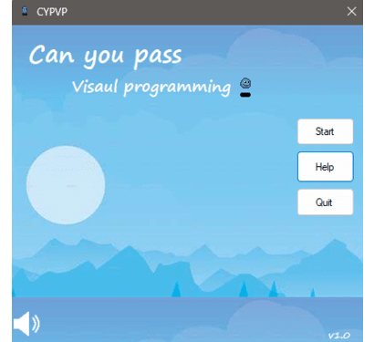
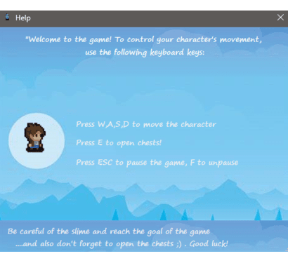
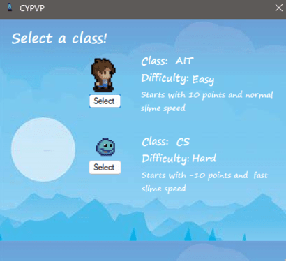
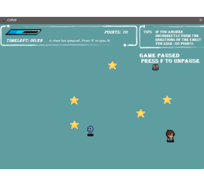
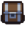
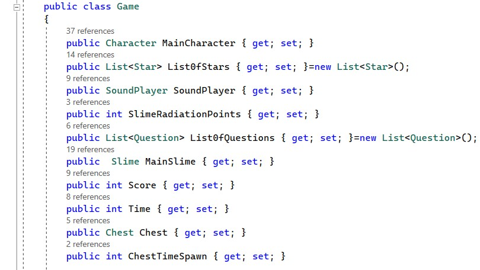

# Can-you-pass-Visual-programming
Windows Forms Project од страна на Живче Глигоров, Тамара Јосифовска и Верoника Коцева.

## Опис на апликацијата
Апликацијата која ја развивамe е игра која се состои од  два карактери, првиот карактер е главна улога, која цели да собере што е можно повеќе поени, додека вториот карактер е противник, кој ќе се обидува да ги намали бројот на поени.Играта вклучува две нивоа: нивото AIT и нивото CS. Нивото AIT е почетното ниво и е дизајнирано за полесно искуство на играње, додека нивото AIT е понапредно кое претставува предизвик за играчите кои бараат повеќе предизвици и брзина.

## Упатство за користење

  

 (Слика 1)

На почетниот прозорец  (Слика 1) при стартување на играта имаме можност да започнеме со играта (Start), да ги погледнеме инструкциите за играта  (Help) и доколку сакаме да завршиме со играта(Quit).

### Help

  

 (Слика 2)

Во Help е обајаснето начинот на движење на карактерот во играта.

### Старт (Start)

Со стартување на играта се прикажува прозорец каде можеме да избереме ниво AIT и нивото CS.

  

 (Слика 3)

  

 (Слика 4)

  

 (Слика 5)

Нивото AIT е првото ниво во играта и е дизајнирано да биде полесно. Ова ниво, се започнува со почетни 10 поени и со секоја собрана ѕвездичка поените се зголемуваат, а бонус поени добивате со секое точно одговорено прашање поврзано со визуелно програмирање кое е сместени во мистериозна кутија  (Слика 5). Воедно, целта е да се избегне противникот, кој се движи побавно во ова ниво доколку не успеете ви се одземмат поени.

Ниво CS започнува со  почетни -10 поени, во ова ниво целта е да се соберат поени и да избегнете вашето побрзо противничко лице кое воспротивно ги намалува поените. Исто така, има можност да се освојат бонус поени со точно одговорени прашања поврзани со визуелно програмирање кои исто така се сместени во мистеризната кутија. Ова ќе помогне да се добие дополнителни поени и да ги подобрите вашите вештини во играта.

Целта на играта е да се избегне slime-от кој доколку е во непосредна близина ве заразува со негововата радијација, ефектот на радијација предизвикува поените на играчот да се намалуваат постепено од зависност кое ниво е одберено.
За да престанат да се намалуваат поените и да се излечи играчот од радијацијата на slime-от потребно е да се собере една звездичка.

## Решение на проблемот

### Податочни структури

Текот на играта е осмислен во класа public class Game.

  

 (Слика 5)

